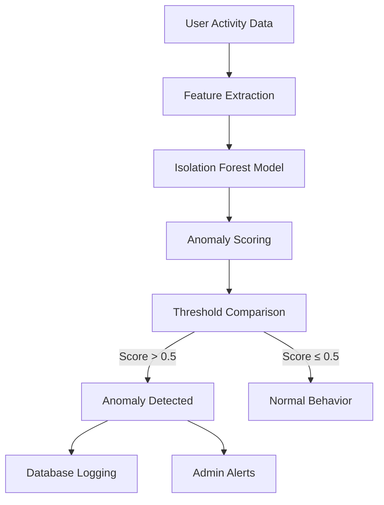

# Anomaly Detection System

## Overview

The Anomaly Detection System uses Rubix ML's Isolation Forest algorithm to identify suspicious user behavior and unusual rental patterns in the video club platform. This system helps prevent fraud, detect account sharing, and identify problematic users.

https://en.wikipedia.org/wiki/Isolation_forest

## Features

### **Anomaly Types Detected**

1. **High Rental Frequency** - Users renting movies at an unusually high rate
2. **Inconsistent Ratings** - Users with highly variable rating patterns
3. **Frequent Late Returns** - Users who consistently return movies late
4. **General Suspicious Activity** - Other unusual behavior patterns

### **Detection Capabilities**

- **Real-time Analysis**: Check individual users on-demand
- **Batch Processing**: Scan all users for anomalies
- **Severity Levels**: Low, Medium, High risk classification
- **Historical Tracking**: Log and track anomalies over time
- **Model Persistence**: Trained model saved for future use

## Technical Architecture

### **System Components**



### **Machine Learning Model**

- **Algorithm**: Isolation Forest (Rubix ML)
- **Contamination Parameter**: 10% (expect 10% of users to be anomalous)
- **Features Used**:
  - Rentals per day (normalized)
  - Average rental duration (days)
  - Rating deviation from user average
  - Return delay percentage

### **Anomaly Scoring**

- **Score Range**: 0.0 (normal) to 1.0 (highly anomalous)
- **Threshold**: 0.5 (scores above this are flagged)
- **Severity Levels**:
  - **High**: Score > 0.8
  - **Medium**: Score > 0.6
  - **Low**: Score > 0.5

## API Endpoints

### **Base URL**: `/api/anomaly`

#### **1. Get Statistics (Public)**
```http
GET /api/anomaly/stats
```

**Response**:
```json
{
    "status": "success",
    "data": {
        "total_anomalies": 42,
        "pending_anomalies": 15,
        "resolved_anomalies": 27,
        "anomaly_types": [
            {"type": "high_rental_frequency", "count": 20},
            {"type": "inconsistent_ratings", "count": 12},
            {"type": "frequent_late_returns", "count": 10}
        ],
        "model_trained": true,
        "last_trained": "2026-02-21 14:30:45"
    }
}
```

#### **2. Check Current User (Authenticated)**
```http
GET /api/anomaly/check-me
Authorization: Bearer {token}
```

**Response**:
```json
{
    "status": "success",
    "is_anomaly": false,
    "score": 0.25,
    "severity": "none",
    "type": "none"
}
```

**Anomaly Response**:
```json
{
    "status": "success",
    "is_anomaly": true,
    "score": 0.87,
    "severity": "high",
    "type": "high_rental_frequency"
}
```

#### **3. Get All Anomalies (Admin Only)**
```http
GET /api/anomaly/
Authorization: Bearer {admin_token}
```

**Response**:
```json
{
    "status": "success",
    "count": 5,
    "data": [
        {
            "user_id": 123,
            "user_name": "John Doe",
            "user_email": "john@example.com",
            "anomaly_score": 0.85,
            "anomaly_type": "high_rental_frequency",
            "severity": "high"
        }
    ]
}
```

#### **4. Get User Anomalies (Admin Only)**
```http
GET /api/anomaly/users/{userId}
Authorization: Bearer {admin_token}
```

**Response**:
```json
{
    "status": "success",
    "user": {
        "id": 123,
        "name": "John Doe",
        "email": "john@example.com"
    },
    "current_analysis": {
        "is_anomaly": true,
        "score": 0.85,
        "severity": "high",
        "type": "high_rental_frequency",
        "features": [0.8, 3.2, 1.8, 0.4]
    },
    "historical_anomalies": [
        {
            "id": 456,
            "type": "high_rental_frequency",
            "score": 0.78,
            "status": "pending",
            "created_at": "2026-02-20 10:15:22"
        }
    ]
}
```

#### **5. Resolve Anomaly (Admin Only)**
```http
POST /api/anomaly/resolve/{anomalyId}
Authorization: Bearer {admin_token}
```

**Response**:
```json
{
    "status": "success",
    "message": "Anomaly marked as resolved"
}
```

#### **6. Retrain Model (Admin Only)**
```http
POST /api/anomaly/retrain
Authorization: Bearer {admin_token}
```

**Response**:
```json
{
    "status": "success",
    "message": "Anomaly detection model retrained successfully",
    "training_time": 2.45
}
```

## Console Commands

### **Detect Anomalies**
```bash
php artisan anomaly:detect
```

**Options**:
- `--retrain`: Force model retraining before detection
- `--check-user=ID`: Check specific user instead of all users

**Example Output**:
```
🕵️‍♂️ Running anomaly detection on all users...
📊 Detection Results:
Total anomalies found: 3
Model trained: ✅ Yes

+---------+------------+----------------------+----------+-----------------------+----------+
| User ID | Name       | Email                | Score    | Type                  | Severity |
+---------+------------+----------------------+----------+-----------------------+----------+
| 123     | John Doe   | john@example.com     | 0.85     | high_rental_frequency | High     |
| 456     | Jane Smith | jane@example.com     | 0.68     | inconsistent_ratings  | Medium   |
| 789     | Bob Johnson| bob@example.com      | 0.55     | frequent_late_returns  | Low      |
+---------+------------+----------------------+----------+-----------------------+----------+

⏱️  Completed in 4.23 seconds
```

### **Check Specific User**
```bash
php artisan anomaly:detect --check-user=123
```

### **Force Retraining**
```bash
php artisan anomaly:detect --retrain
```

## Implementation Details

### **Feature Engineering**

The system extracts these features from user behavior:

1. **Rentals per Day**: `rental_count / account_age_days`
2. **Average Rental Duration**: Mean days between rental and return
3. **Rating Deviation**: Average absolute deviation from user's mean rating
4. **Return Delay Percentage**: Percentage of rentals returned late

### **Anomaly Detection Process**

1. **Data Collection**: Gather user rental and rating data
2. **Feature Extraction**: Calculate behavioral features
3. **Model Training**: Train Isolation Forest on user data
4. **Scoring**: Calculate anomaly scores for all users
5. **Thresholding**: Flag users with scores > 0.5
6. **Classification**: Determine anomaly type and severity
7. **Logging**: Store anomalies in database

### **Model Persistence**

- **Model File**: `storage/app/anomaly_detector.model`
- **Dataset File**: `storage/app/anomaly_dataset.csv`
- **Automatic Training**: Model trains automatically if not present
- **Manual Retraining**: Available via API or console command

## Database Schema

### **anomaly_detections Table**

```sql
CREATE TABLE anomaly_detections (
    id BIGINT UNSIGNED AUTO_INCREMENT PRIMARY KEY,
    user_id BIGINT UNSIGNED NOT NULL,
    type VARCHAR(255) NOT NULL,
    score DECIMAL(5,4) NOT NULL,
    details JSON NULL,
    status VARCHAR(255) DEFAULT 'pending',
    resolved_at TIMESTAMP NULL,
    created_at TIMESTAMP NULL,
    updated_at TIMESTAMP NULL,
    FOREIGN KEY (user_id) REFERENCES users(id) ON DELETE CASCADE
);
```

**Fields**:
- `user_id`: Reference to the user
- `type`: Anomaly type (high_rental_frequency, inconsistent_ratings, etc.)
- `score`: Anomaly score (0.0-1.0)
- `details`: Additional context (JSON)
- `status`: pending, resolved, or ignored
- `resolved_at`: When the anomaly was resolved

## Integration Examples

### **PHP Integration**

```php
use App\Services\AnomalyDetector;

// Check a specific user
$detector = new AnomalyDetector();
$result = $detector->checkUserAnomaly($user);

if ($result['is_anomaly']) {
    // Handle anomalous user
    Log::warning("Anomaly detected for user {$user->id}: {$result['type']}");
    
    if ($result['severity'] === 'high') {
        // Take immediate action
        $user->suspend();
    }
}
```

### **JavaScript Integration**

```javascript
// Check current user
async function checkForAnomalies() {
    const response = await fetch('/api/anomaly/check-me', {
        headers: {
            'Authorization': `Bearer ${token}`
        }
    });
    
    const data = await response.json();
    
    if (data.is_anomaly) {
        console.warn(`Anomaly detected: ${data.type} (${data.severity})`);
        // Show warning or take action
    }
}
```

### **Automated Monitoring**

```bash
# Add to cron for daily anomaly detection
0 3 * * * cd /path/to/project && php artisan anomaly:detect >> /var/log/anomaly_detection.log 2>&1
```

## Use Cases

### **1. Fraud Prevention**
- Detect users sharing accounts
- Identify suspicious rental patterns
- Prevent abuse of rental policies

### **2. Risk Management**
- Flag users with high late return rates
- Identify potential revenue loss
- Prioritize collections efforts

### **3. Customer Service**
- Proactively contact at-risk users
- Offer assistance to users with unusual patterns
- Improve user experience

### **4. Business Intelligence**
- Understand user behavior patterns
- Identify system abuse trends
- Improve rental policies

## Performance Characteristics

- **Training Time**: ~2-5 seconds (depends on user count)
- **Detection Time**: ~1-3 seconds for all users
- **Single User Check**: < 100ms
- **Memory Usage**: Low (Isolation Forest is memory-efficient)
- **Scalability**: Handles thousands of users efficiently

## Error Handling

The system includes comprehensive error handling:

```json
{
    "status": "error",
    "message": "User not found",
    "error": "Not found"
}
```

Common error scenarios:
- User not found (404)
- Insufficient data for analysis
- Model training failures
- Database connection issues

## Files and Locations

- **Service**: `app/Services/AnomalyDetector.php`
- **Model**: `app/Models/AnomalyDetection.php`
- **Controller**: `app/Http/Controllers/AnomalyController.php`
- **Console Command**: `app/Console/Commands/DetectAnomalies.php`
- **Routes**: `routes/api.php`
- **Migration**: `database/migrations/2026_02_21_000000_create_anomaly_detections_table.php`
- **Test**: `tests/Feature/AnomalyDetectionTest.php`
- **Storage**: `storage/app/anomaly_detector.model`, `storage/app/anomaly_dataset.csv`

## Security Considerations

- **Authentication**: All sensitive endpoints require authentication
- **Authorization**: Admin-only endpoints use Laravel policies
- **Data Privacy**: Anomaly data is associated with user accounts
- **Audit Trail**: All anomalies are logged with timestamps

## Future Enhancements

### **Short-term Improvements**
1. **Email Notifications**: Automatically notify admins of high-severity anomalies
2. **Automatic Actions**: Configurable responses to different anomaly types
3. **Dashboard Integration**: Visual analytics for anomaly trends
4. **Export Functionality**: CSV/Excel export of anomaly reports

### **Long-term Enhancements**
1. **Multiple Detection Algorithms**: Support for Local Outlier Factor, One-Class SVM
2. **Real-time Monitoring**: Stream-based anomaly detection
3. **Behavioral Profiling**: Long-term user behavior tracking
4. **Machine Learning Pipeline**: Automated feature engineering
5. **Integration with Other Systems**: Payment fraud detection, content abuse detection

## Best Practices

### **Model Maintenance**
- **Retrain Regularly**: Monthly or when user behavior patterns change
- **Monitor Performance**: Track false positives/negatives
- **Adjust Thresholds**: Fine-tune based on business needs
- **Feature Review**: Periodically review and update features

### **Operational Guidelines**
- **Review Anomalies Daily**: Check new anomalies regularly
- **Investigate High-Severity**: Prioritize high-severity anomalies
- **Document Resolutions**: Keep records of anomaly resolutions
- **User Communication**: Be transparent about detection (where appropriate)

## Troubleshooting

### **Common Issues**

**Problem**: No anomalies detected when expected
- **Solution**: Check model training, adjust contamination parameter, review feature engineering

**Problem**: Too many false positives
- **Solution**: Increase threshold, add more features, retrain with more data

**Problem**: Slow detection performance
- **Solution**: Optimize database queries, cache results, consider sampling for large user bases

**Problem**: Model fails to train
- **Solution**: Check dataset preparation, ensure sufficient data, verify file permissions

## Troubleshooting

### **Common Issues**

**Problem**: No anomalies detected when expected
- **Solution**: Check model training, adjust contamination parameter, review feature engineering

**Problem**: Too many false positives
- **Solution**: Increase threshold, add more features, retrain with more data

**Problem**: Slow detection performance
- **Solution**: Optimize database queries, cache results, consider sampling for large user bases

**Problem**: Model fails to train
- **Solution**: Check dataset preparation, ensure sufficient data, verify file permissions

### **Current Limitations**

- **Dataset Size**: Currently trained on 55 users (small dataset)
- **Feature Range**: All features show relatively narrow distribution
- **No Late Returns**: Current dataset has 0% return delays
- **Threshold Sensitivity**: May need adjustment as user base grows

### **Future Enhancements Planned**

1. **Enhanced Feature Engineering**: Add more behavioral features
2. **Dynamic Thresholding**: Auto-adjust based on dataset characteristics
3. **Anomaly Pattern Analysis**: Group similar anomalies for trend detection
4. **Email Notifications**: Automatic alerts for high-severity anomalies
5. **Dashboard Integration**: Visual analytics for anomaly trends

## Support

For issues with the Anomaly Detection System:
- Check application logs: `storage/logs/laravel.log`
- Review anomaly detection logs: `storage/logs/anomaly_detection.log`
- Contact development team with specific error messages and reproduction steps

## References

- [Isolation Forest Algorithm](https://scikit-learn.org/stable/modules/generated/sklearn.ensemble.IsolationForest.html)
- [Rubix ML Documentation](https://rubixml.com)
- [Anomaly Detection Techniques](https://en.wikipedia.org/wiki/Anomaly_detection)

## Support

For issues with the Anomaly Detection System:
- Check application logs: `storage/logs/laravel.log`
- Review anomaly detection logs: `storage/logs/anomaly_detection.log`
- Contact development team with specific error messages and reproduction steps