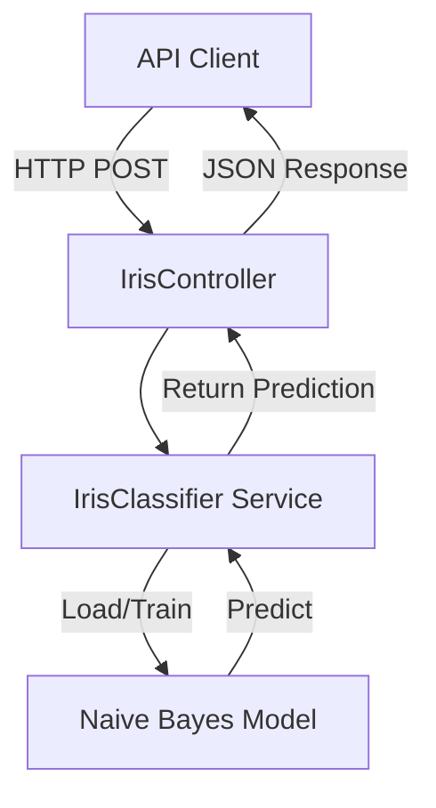

# Iris Flower Classification System

## Overview

The Iris Prediction System is a machine learning service that classifies iris flowers into one of three species based on their morphological measurements. This system uses a Naive Bayes classifier trained on the famous Iris dataset to predict the species of iris flowers.

## Features

- **Species Classification**: Predicts one of three iris species:
  - Iris-setosa
  - Iris-versicolor  
  - Iris-virginica

- **Real-time Predictions**: Provides instant classification via API endpoint
- **Automatic Model Training**: Trains model automatically if not already trained
- **Persistent Model**: Saves trained model for future use

## Technical Architecture

### Components



### Data Flow

1. **Input**: Four numerical measurements (sepal length, sepal width, petal length, petal width)
2. **Processing**: Naive Bayes classification algorithm
3. **Output**: Predicted iris species

## API Endpoint

### Predict Iris Species

**Endpoint**: `POST /api/iris/predict`

**Request Body**:
```json
{
    "sepal_length": 5.1,
    "sepal_width": 3.5, 
    "petal_length": 1.4,
    "petal_width": 0.2
}
```

**Parameters**:
- `sepal_length` (required, numeric): Length of sepal in centimeters
- `sepal_width` (required, numeric): Width of sepal in centimeters
- `petal_length` (required, numeric): Length of petal in centimeters
- `petal_width` (required, numeric): Width of petal in centimeters

**Response**:
```json
{
    "input": [5.1, 3.5, 1.4, 0.2],
    "prediction": "Iris-setosa"
}
```

**Response Fields**:
- `input`: Array of input features used for prediction
- `prediction`: Predicted iris species

**Status Codes**:
- `200 OK`: Successful prediction
- `422 Unprocessable Entity`: Validation error (missing/invalid parameters)

## Implementation Details

### Model Training

The system uses the Rubix ML library with a Naive Bayes classifier:

- **Algorithm**: Naive Bayes (Gaussian distribution)
- **Training Data**: Iris dataset (150 samples, 4 features)
- **Features**: Sepal length, sepal width, petal length, petal width
- **Target**: Iris species (3 classes)
- **Model Persistence**: Serialized model saved to `storage/app/iris.model`

### Automatic Training

The system automatically trains the model when:
1. No pre-trained model exists (`storage/app/iris.model` not found)
2. First prediction request is received

### Dataset

The training dataset is stored in `storage/app/iris.csv` with the following structure:

```csv
sepal_length,sepal_width,petal_length,petal_width,label
6.3,3.3,6.0,2.5,Iris-virginica
5.1,3.5,1.4,0.2,Iris-setosa
...
```

## Usage Examples

### cURL Example

```bash
curl -X POST "http://localhost/api/iris/predict" \
     -H "Content-Type: application/json" \
     -H "Accept: application/json" \
     -d '{"sepal_length":5.1,"sepal_width":3.5,"petal_length":1.4,"petal_width":0.2}'
```

### JavaScript Example

```javascript
fetch('/api/iris/predict', {
    method: 'POST',
    headers: {
        'Content-Type': 'application/json',
        'Accept': 'application/json'
    },
    body: JSON.stringify({
        sepal_length: 5.1,
        sepal_width: 3.5,
        petal_length: 1.4,
        petal_width: 0.2
    })
})
.then(response => response.json())
.then(data => console.log(data));
```

### PHP Example

```php
$client = new \GuzzleHttp\Client();
$response = $client->post('http://localhost/api/iris/predict', [
    'json' => [
        'sepal_length' => 5.1,
        'sepal_width' => 3.5,
        'petal_length' => 1.4,
        'petal_width' => 0.2
    ]
]);

$data = json_decode($response->getBody(), true);
echo "Prediction: " . $data['prediction'];
```

## Example Predictions

### Typical Iris-setosa
```json
Input: {"sepal_length":5.1,"sepal_width":3.5,"petal_length":1.4,"petal_width":0.2}
Prediction: "Iris-setosa"
```

### Typical Iris-versicolor
```json
Input: {"sepal_length":7.0,"sepal_width":3.2,"petal_length":4.7,"petal_width":1.4}
Prediction: "Iris-versicolor"
```

### Typical Iris-virginica
```json
Input: {"sepal_length":6.3,"sepal_width":3.3,"petal_length":6.0,"petal_width":2.5}
Prediction: "Iris-virginica"
```

## Performance Characteristics

- **Training Time**: ~1-2 seconds (first run only)
- **Prediction Time**: < 100ms per request
- **Accuracy**: Typically 90-95% on iris dataset
- **Memory Usage**: Low (Naive Bayes is memory-efficient)

## Error Handling

The system validates input parameters and returns appropriate error responses:

```json
{
    "message": "The sepal length field is required.",
    "errors": {
        "sepal_length": ["The sepal length field is required."]
    }
}
```

## Files and Locations

- **Controller**: `app/Http/Controllers/IrisController.php`
- **Service**: `app/Services/IrisClassifier.php`
- **Route**: `routes/api.php` (line 29)
- **Dataset**: `storage/app/iris.csv`
- **Model**: `storage/app/iris.model` (auto-generated)

## Dependencies

- **Rubix ML**: Machine learning library for PHP
- **Laravel**: PHP framework for web services

## Future Enhancements

Potential improvements to consider:

1. **Model Versioning**: Support multiple model versions
2. **Retraining Endpoint**: API endpoint to force model retraining
3. **Batch Prediction**: Support for multiple predictions in single request
4. **Confidence Scores**: Return prediction probabilities
5. **Model Monitoring**: Track prediction accuracy over time
6. **Alternative Algorithms**: Support for different classification algorithms

## References

- [Iris Dataset (UCI Machine Learning Repository)](https://archive.ics.uci.edu/ml/datasets/iris)
- [Rubix ML Documentation](https://rubixml.com)
- [Naive Bayes Classifier](https://en.wikipedia.org/wiki/Naive_Bayes_classifier)

## Support

For issues or questions regarding the Iris Prediction System, please contact the development team or refer to the main project documentation.