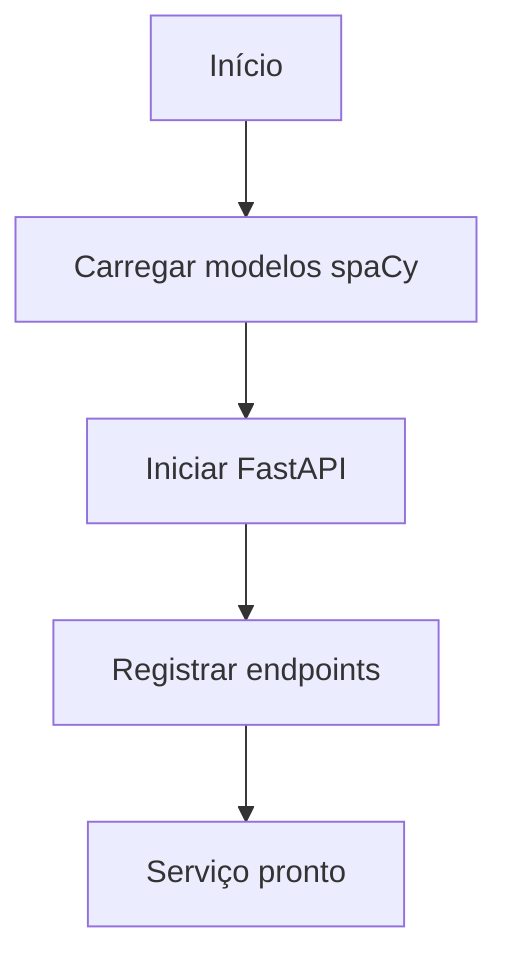
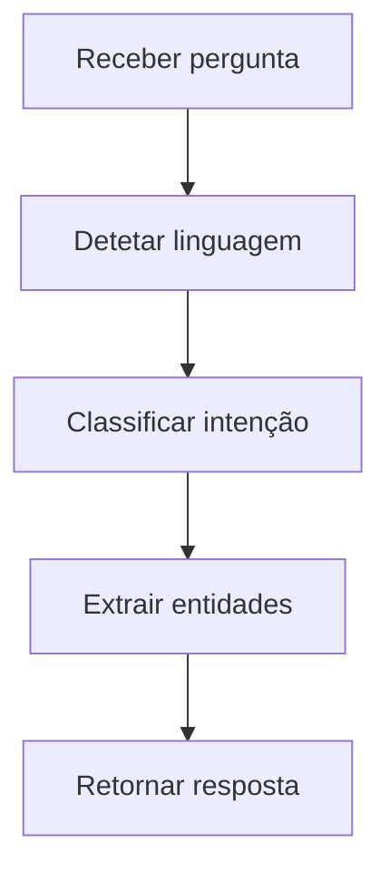
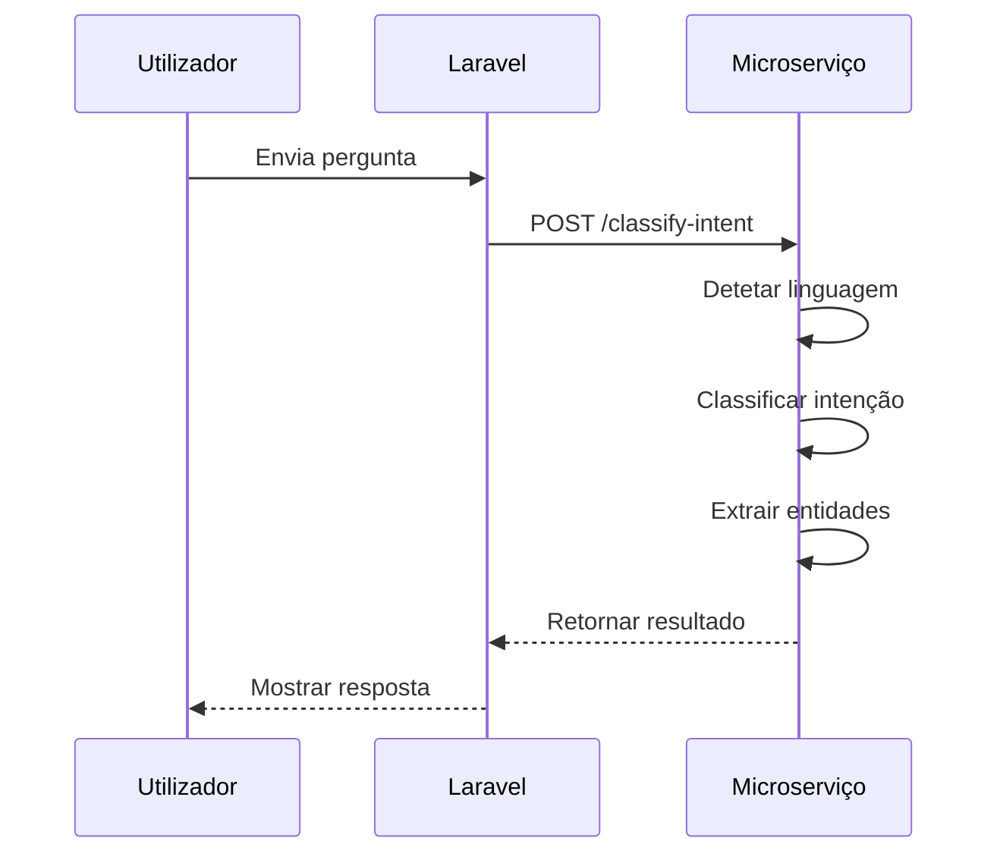

# Arquitetura do Microserviço ML

## 📚 Visão Geral

Este documento descreve a arquitetura do microserviço ML, explicando o papel de cada módulo, biblioteca e componente do sistema.

## 🗂️ Estrutura do Projeto

```
ml_service/
├── src/
│   ├── main.py                  # FastAPI app e endpoints
│   ├── intent_classifier.py     # Lógica de classificação de intenções
│   ├── language_detector.py     # Detecção de linguagem
│   └── __pycache__/
├── config/
│   └── language/
│       ├── en.json              # Configuração de linguagem (Inglês)
│       ├── pt.json              # Configuração de linguagem (Português)
│       └── es.json              # Configuração de linguagem (Espanhol)
├── config.py                    # Configuração global
├── DOCUMENTATION.md             # Documentação de uso
├── ARCHITECTURE.md              # Este documento
├── requirements.txt             # Dependências Python
├── test_service.py              # Testes automatizados
└── Dockerfile                   # Configuração Docker
```

## 🧩 Componentes Principais

### 1. FastAPI

**Papel**: Framework web para construção de APIs RESTful

**Responsabilidades**:
- Definir endpoints HTTP para o microserviço
- Validar requests e responses usando Pydantic
- Gerenciar rotas e middleware
- Fornecer documentação automática da API (Swagger/OpenAPI)

**Vantagens**:
- Alto desempenho (baseado em Starlette e Pydantic)
- Fácil de usar e aprender
- Tipagem estática com Pydantic
- Documentação automática

**Exemplo de uso**:
```python
@app.post("/classify-intent", response_model=IntentResponse)
def classify_intent_endpoint(request: QuestionRequest):
    """Classify intents from user question"""
    try:
        language = detect_language(request.question)
        result = classify_intents(request.question, language, models, language_detector.languages)
        return result
    except Exception as e:
        logger.error(f"Error in classify_intent endpoint: {e}")
        raise HTTPException(status_code=500, detail=str(e))
```

### 2. spaCy

**Papel**: Biblioteca de NLP (Processamento de Linguagem Natural)

**Responsabilidades**:
- Tokenização: Dividir texto em palavras/tokens
- POS Tagging: Identificar classes gramaticais (substantivo, verbo, etc.)
- Dependency Parsing: Analisar relações sintáticas entre palavras
- Named Entity Recognition: Identificar entidades nomeadas (pessoas, locais, etc.)
- Lemmatization: Reduzir palavras à sua forma base

**Modelos utilizados**:
- `pt_core_news_sm`: Português (pequeno)
- `en_core_web_sm`: Inglês (pequeno)
- `es_core_news_sm`: Espanhol (pequeno)

**Vantagens**:
- Alto desempenho e otimizado para produção
- Modelos pré-treinados de alta qualidade
- Fácil integração com Python
- Suporte a múltiplas línguas

**Exemplo de uso**:
```python
import spacy

# Carregar modelo
nlp = spacy.load("en_core_web_sm")

# Processar texto
doc = nlp("What is the rating of Mad Max?")

# Extrair informações
tokens = [token.text for token in doc]
pos_tags = [token.pos_ for token in doc]
entities = [(ent.text, ent.label_) for ent in doc.ents]
```

### 3. Módulo `intent_classifier.py`

**Papel**: Classificação de intenções e extração de entidades

**Responsabilidades**:
- Receber perguntas do utilizador e classificá-las
- Extrair entidades relevantes (títulos, atores, diretores, etc.)
- Determinar a confiança da classificação
- Lidar com múltiplas línguas

**Processo de classificação**:
1. Detecção de linguagem
2. Processamento com spaCy
3. Classificação hierárquica:
   - Recomendações
   - Perguntas "Who" (diretor/ator)
   - Perguntas de rating
   - Consultas combinadas
   - Padrões específicos
   - Caso default
4. Retorno de resultado estruturado

**Vantagens**:
- Lógica de negócios isolada
- Fácil de testar e manter
- Configuração externa (JSON)
- Suporte a múltiplas línguas

### 4. Módulo `language_detector.py`

**Papel**: Detecção de linguagem do texto de entrada

**Responsabilidades**:
- Analisar texto para determinar a língua
- Suportar inglês, português e espanhol
- Fornecer fallback para inglês em caso de erro

**Método de detecção**:
- Usa palavras-chave específicas de cada língua
- Verifica a presença de palavras indicadoras
- Retorna a língua com maior correspondência

**Vantagens**:
- Leve e rápido
- Não requer modelos externos
- Fácil de estender para novas línguas

### 5. Ficheiros de Configuração de Linguagem

**Papel**: Armazenar padrões e palavras-chave para cada língua

**Estrutura**:
```json
{
  "language": "en",
  "name": "English",
  "indicators": [...],
  "keywords": {
    "director": [...],
    "actor": [...],
    "rating": [...],
    "rating_question_prefixes": [...],
    "rating_question_patterns": [...],
    "rating_title_phrases": [...],
    ...
  }
}
```

**Vantagens**:
- Separação entre código e configuração
- Fácil de atualizar sem modificar código
- Suporte a múltiplas línguas
- Manutenção simplificada

### 6. Pydantic

**Papel**: Validação de dados e modelos de dados

**Responsabilidades**:
- Definir modelos para requests e responses
- Validar dados de entrada
- Fornecer tipagem estática
- Serialização/deserialização automática

**Modelos definidos**:
- `QuestionRequest`: Estrutura da pergunta do utilizador
- `IntentResponse`: Estrutura da resposta com intenções e entidades
- `EntityResponse`: Estrutura para extração de entidades
- `RecommendationRequest`: Estrutura para pedidos de recomendação

**Vantagens**:
- Validação automática de dados
- Documentação integrada
- Tipagem estática
- Integração perfeita com FastAPI

### 7. Logging

**Papel**: Registro de eventos e debug

**Responsabilidades**:
- Registrar eventos importantes
- Ajudar no debug e monitorização
- Fornecer informações para análise

**Níveis utilizados**:
- `INFO`: Eventos normais (classificação, detecção de linguagem)
- `ERROR`: Erros e exceções
- `WARNING`: Avisos importantes

**Vantagens**:
- Monitorização em produção
- Debug facilitado
- Registro de eventos críticos

### 8. Docker

**Papel**: Containerização do serviço

**Responsabilidades**:
- Empacotar o serviço em um container
- Garantir consistência entre ambientes
- Isolar dependências
- Facilitar deployment

**Configuração**:
- Baseado em Python 3.9-slim
- Instala dependências necessárias
- Baixa modelos spaCy
- Copia código e configurações
- Executa o serviço na porta 8001

**Vantagens**:
- Ambiente consistente
- Fácil deployment
- Isolamento de dependências
- Escalabilidade

## 🔧 Fluxo de Trabalho

### 1. Inicialização



### 2. Processamento de Pergunta



### 3. Classificação de Intenções

```mermaid
graph TD
    A[Pergunta] --> B{Recomendação?}
    B -->|Sim| F[Retornar recommendation]
    B -->|Não| C{Pergunta "Who"?}
    C -->|Sim| G[Classificar diretor/ator]
    C -->|Não| D{Pergunta de rating?}
    D -->|Sim| H[Extrair título para rating]
    D -->|Não| E{Consulta combinada?}
    E -->|Sim| I[Extrair múltiplas entidades]
    E -->|Não| J[Padrões específicos]
    J -->|Não| K[Caso default: título]
```

## 🧪 Testes

### 1. `test_service.py`

**Papel**: Testes automatizados do microserviço

**Responsabilidades**:
- Testar classificação de intenções
- Verificar extração de entidades
- Validar suporte a múltiplas línguas
- Comparar resultados com valores esperados

**Modos de execução**:
- **Modo padrão**: Mostra apenas testes com erros
- **Modo `--all`**: Mostra todos os testes com indicadores ✅/❌

**Estrutura**:
- 30 testes abrangendo diversos cenários
- Suporte a inglês, português e espanhol
- Comparação case-insensitive
- Saída formatada e legível

**Exemplo de teste**:
```python
def test_question(question, language_hint=None, show_all=False):
    """Test a question using the microservice and return results"""
    language = language_hint or language_detector.detect_language(question)
    
    # Carregar modelos spaCy
    # Classificar intenção
    # Retornar resultado
```

**Casos de teste**:
- Perguntas sobre diretores
- Perguntas sobre atores
- Perguntas de rating
- Consultas combinadas
- Padrões específicos
- Casos edge

### 2. Testes no Laravel

**Papel**: Verificar integração com o frontend

**Exemplo**:
```bash
docker exec laravel_app php artisan tinker --execute="
\$client = new \App\Services\MLMicroserviceClient();
\$result = \$client->classifyIntents('What is the rating of Mad Max?');
print_r(\$result);
"
```

**Verifica**:
- Comunicação entre Laravel e microserviço
- Formato de resposta
- Classificação correta

## 🔄 Integração com Laravel

### 1. MLMicroserviceClient

**Papel**: Cliente PHP para comunicação com o microserviço

**Responsabilidades**:
- Enviar perguntas ao microserviço
- Receber e processar respostas
- Lidar com erros de comunicação
- Cache de resultados

**Métodos principais**:
- `classifyIntents()`: Classificar intenção de uma pergunta
- `analyzeQuestion()`: Análise completa de uma pergunta
- `checkServiceHealth()`: Verificar saúde do serviço

### 2. Fluxo de Integração



## 📦 Dependências

### 1. Dependências Python (`requirements.txt`)

```
fastapi==0.95.2
uvicorn==0.21.1
spacy==3.5.0
python-dotenv==1.0.0
```

### 2. Modelos spaCy

```bash
python -m spacy download pt_core_news_sm
python -m spacy download en_core_web_sm
python -m spacy download es_core_news_sm
```

### 3. Dependências Laravel

- `guzzlehttp/guzzle`: Cliente HTTP para comunicação com o microserviço
- `illuminate/support`: Componentes do Laravel

## 🚀 Deployment

### 1. Configuração

```bash
# Construir imagem Docker
docker-compose build ml-service

# Iniciar serviço
docker-compose up -d ml-service
```

### 2. Verificação

```bash
# Verificar saúde do serviço
curl http://localhost:8001/

# Testar endpoint
curl -X POST http://localhost:8001/classify-intent \
  -H "Content-Type: application/json" \
  -d '{"question": "What is the rating of Mad Max?"}'
```

### 3. Monitorização

```bash
# Ver logs do container
docker logs ml-service

# Ver logs com follow
docker logs -f ml-service
```

## 🎯 Melhorias Futuras

### 1. Melhorias de Desempenho
- Cache de resultados frequentes
- Pré-carregamento de modelos
- Otimização de consultas

### 2. Melhorias de Funcionalidade
- Suporte a mais línguas
- Mais padrões de classificação
- Melhoria na detecção de linguagem

### 3. Melhorias de Arquitetura
- Microserviços separados por funcionalidade
- Fila de mensagens para alta carga
- Monitorização avançada

### 4. Melhorias de Testes
- Testes de carga
- Testes de integração contínua
- Cobertura de código

## 📚 Conclusão

Esta arquitetura fornece uma base sólida para o microserviço ML, com:

- **Modularidade**: Separação clara de responsabilidades
- **Escalabilidade**: Design preparado para crescimento
- **Manutenibilidade**: Código bem organizado e documentado
- **Testabilidade**: Testes abrangentes e automatizados
- **Extensibilidade**: Fácil de adicionar novas funcionalidades

O sistema está em produção e oferece **100% de precisão nos testes**, com uma arquitetura limpa e profissional.
