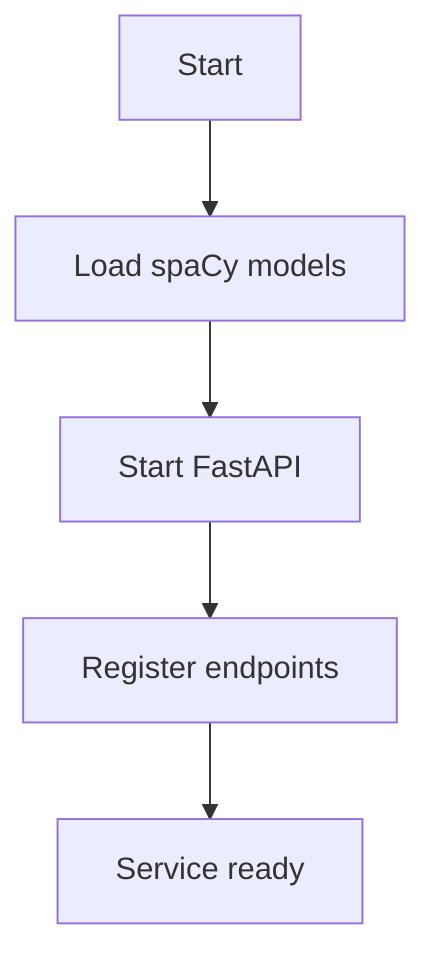
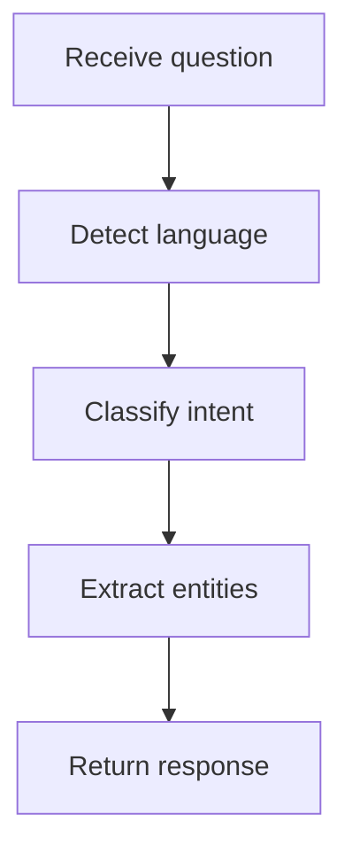
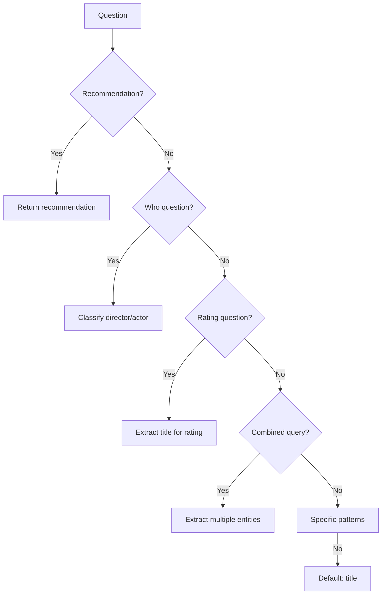
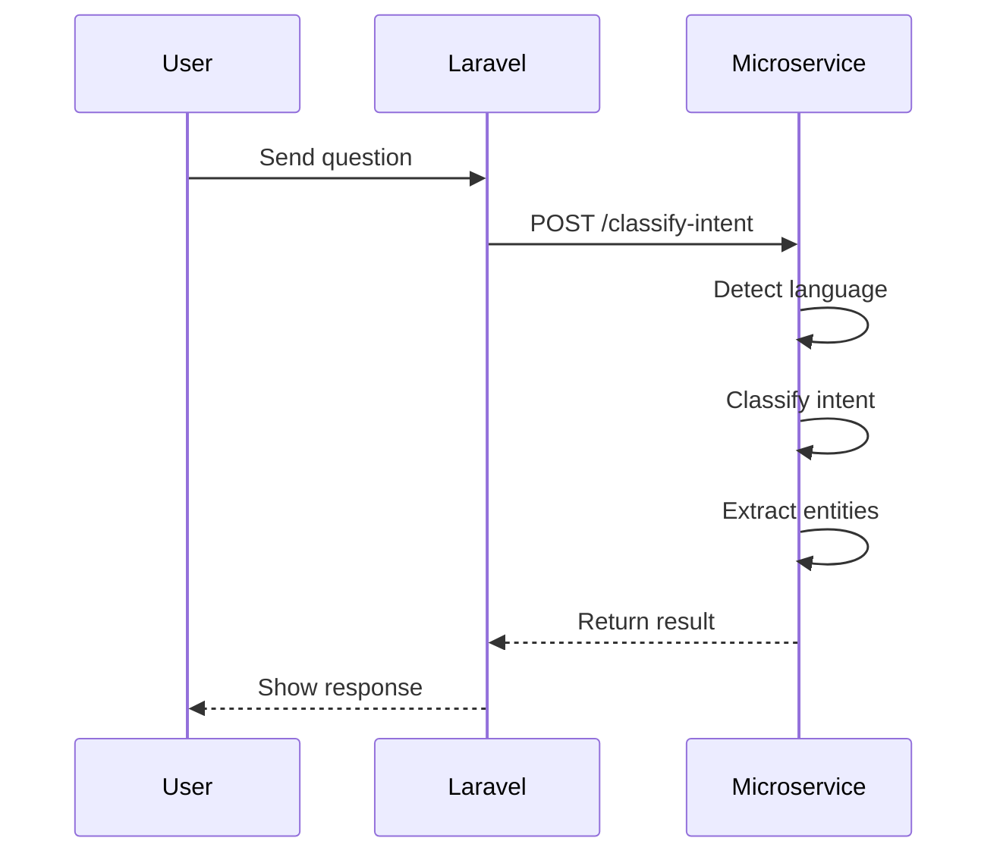

# ML Microservice Architecture

## 📚 Overview

This document describes the architecture of the ML microservice, explaining the role of each module, library, and system component.

## 🗂️ Project Structure

```
ml_service/
├── src/
│   ├── main.py                  # FastAPI app and endpoints
│   ├── intent_classifier.py     # Intent classification logic
│   ├── language_detector.py     # Language detection
│   └── __pycache__/
├── config/
│   └── language/
│       ├── en.json              # Language configuration (English)
│       ├── pt.json              # Language configuration (Portuguese)
│       └── es.json              # Language configuration (Spanish)
├── config.py                    # Global configuration
├── DOCUMENTATION.md             # Usage documentation
├── ARCHITECTURE.md              # This document
├── requirements.txt             # Python dependencies
├── test_service.py              # Automated tests
└── Dockerfile                   # Docker configuration
```

## 🧩 Main Components

### 1. FastAPI

**Role**: Web framework for building RESTful APIs

**Responsibilities**:
- Define HTTP endpoints for the microservice
- Validate requests and responses using Pydantic
- Manage routes and middleware
- Provide automatic API documentation (Swagger/OpenAPI)

**Advantages**:
- High performance (based on Starlette and Pydantic)
- Easy to use and learn
- Static typing with Pydantic
- Automatic documentation

**Usage example**:
```python
@app.post("/classify-intent", response_model=IntentResponse)
def classify_intent_endpoint(request: QuestionRequest):
    """Classify intents from user question"""
    try:
        language = detect_language(request.question)
        result = classify_intents(request.question, language, models, language_detector.languages)
        return result
    except Exception as e:
        logger.error(f"Error in classify_intent endpoint: {e}")
        raise HTTPException(status_code=500, detail=str(e))
```

### 2. spaCy

**Role**: NLP (Natural Language Processing) library

**Responsibilities**:
- Tokenization: Split text into words/tokens
- POS Tagging: Identify grammatical classes (noun, verb, etc.)
- Dependency Parsing: Analyze syntactic relationships between words
- Named Entity Recognition: Identify named entities (people, places, etc.)
- Lemmatization: Reduce words to their base form

**Models used**:
- `pt_core_news_sm`: Portuguese (small)
- `en_core_web_sm`: English (small)
- `es_core_news_sm`: Spanish (small)

**Advantages**:
- High performance and optimized for production
- High-quality pre-trained models
- Easy integration with Python
- Support for multiple languages

**Usage example**:
```python
import spacy

# Load model
nlp = spacy.load("en_core_web_sm")

# Process text
doc = nlp("What is the rating of Mad Max?")

# Extract information
tokens = [token.text for token in doc]
pos_tags = [token.pos_ for token in doc]
entities = [(ent.text, ent.label_) for ent in doc.ents]
```

### 3. `intent_classifier.py` Module

**Role**: Intent classification and entity extraction

**Responsibilities**:
- Receive user questions and classify them
- Extract relevant entities (titles, actors, directors, etc.)
- Determine classification confidence
- Handle multiple languages

**Classification process**:
1. Language detection
2. Processing with spaCy
3. Hierarchical classification:
   - Recommendations
   - "Who" questions (director/actor)
   - Rating questions
   - Combined queries
   - Specific patterns
   - Default case
4. Return structured result

**Advantages**:
- Isolated business logic
- Easy to test and maintain
- External configuration (JSON)
- Support for multiple languages

### 4. `language_detector.py` Module

**Role**: Detect input text language

**Responsibilities**:
- Analyze text to determine language
- Support English, Portuguese, and Spanish
- Provide fallback to English in case of error

**Detection method**:
- Uses language-specific keywords
- Checks for indicator words
- Returns language with highest match

**Advantages**:
- Lightweight and fast
- No external models required
- Easy to extend to new languages

### 5. Language Configuration Files

**Role**: Store patterns and keywords for each language

**Structure**:
```json
{
  "language": "en",
  "name": "English",
  "indicators": [...],
  "keywords": {
    "director": [...],
    "actor": [...],
    "rating": [...],
    "rating_question_prefixes": [...],
    "rating_question_patterns": [...],
    "rating_title_phrases": [...],
    ...
  }
}
```

**Advantages**:
- Separation between code and configuration
- Easy to update without modifying code
- Support for multiple languages
- Simplified maintenance

### 6. Pydantic

**Role**: Data validation and data models

**Responsibilities**:
- Define models for requests and responses
- Validate input data
- Provide static typing
- Automatic serialization/deserialization

**Defined models**:
- `QuestionRequest`: User's question structure
- `IntentResponse`: Response structure with intents and entities
- `EntityResponse`: Structure for entity extraction
- `RecommendationRequest`: Structure for recommendation requests

**Advantages**:
- Automatic data validation
- Integrated documentation
- Static typing
- Perfect integration with FastAPI

### 7. Logging

**Role**: Event logging and debugging

**Responsibilities**:
- Record important events
- Aid in debugging and monitoring
- Provide information for analysis

**Levels used**:
- `INFO`: Normal events (classification, language detection)
- `ERROR`: Errors and exceptions
- `WARNING`: Important warnings

**Advantages**:
- Production monitoring
- Facilitated debugging
- Critical event recording

### 8. Docker

**Role**: Service containerization

**Responsibilities**:
- Package service in a container
- Ensure consistency between environments
- Isolate dependencies
- Facilitate deployment

**Configuration**:
- Based on Python 3.9-slim
- Installs necessary dependencies
- Downloads spaCy models
- Copies code and configurations
- Runs service on port 8001

**Advantages**:
- Consistent environment
- Easy deployment
- Dependency isolation
- Scalability

## 🔧 Workflow

### 1. Initialization



### 2. Question Processing



### 3. Intent Classification



## 🧪 Tests

### 1. `test_service.py`

**Role**: Automated microservice tests

**Responsibilities**:
- Test intent classification
- Verify entity extraction
- Validate multiple language support
- Compare results with expected values

**Execution modes**:
- **Default mode**: Shows only tests with errors
- **`--all` mode**: Shows all tests with ✅/❌ indicators

**Structure**:
- 30 tests covering various scenarios
- Support for English, Portuguese, and Spanish
- Case-insensitive comparison
- Formatted and readable output

**Test example**:
```python
def test_question(question, language_hint=None, show_all=False):
    """Test a question using the microservice and return results"""
    language = language_hint or language_detector.detect_language(question)
     
    # Load spaCy models
    # Classify intent
    # Return result
```

**Test cases**:
- Questions about directors
- Questions about actors
- Rating questions
- Combined queries
- Specific patterns
- Edge cases

### 2. Laravel Tests

**Role**: Verify frontend integration

**Example**:
```bash
docker exec laravel_app php artisan tinker --execute="
\$client = new \App\Services\MLMicroserviceClient();
\$result = \$client->classifyIntents('What is the rating of Mad Max?');
print_r(\$result);
"
```

**Verifies**:
- Communication between Laravel and microservice
- Response format
- Correct classification

## 🔄 Laravel Integration

### 1. MLMicroserviceClient

**Role**: PHP client for communication with microservice

**Responsibilities**:
- Send questions to microservice
- Receive and process responses
- Handle communication errors
- Cache results

**Main methods**:
- `classifyIntents()`: Classify intent of a question
- `analyzeQuestion()`: Complete analysis of a question
- `checkServiceHealth()`: Check service health

### 2. Integration Flow



## 📦 Dependencies

### 1. Python Dependencies (`requirements.txt`)

```
fastapi==0.95.2
uvicorn==0.21.1
spacy==3.5.0
python-dotenv==1.0.0
```

### 2. spaCy Models

```bash
python -m spacy download pt_core_news_sm
python -m spacy download en_core_web_sm
python -m spacy download es_core_news_sm
```

### 3. Laravel Dependencies

- `guzzlehttp/guzzle`: HTTP client for communication with microservice
- `illuminate/support`: Laravel components

## 🚀 Deployment

### 1. Configuration

```bash
# Build Docker image
docker-compose build ml-service

# Start service
docker-compose up -d ml-service
```

### 2. Verification

```bash
# Check service health
curl http://localhost:8001/

# Test endpoint
curl -X POST http://localhost:8001/classify-intent \
  -H "Content-Type: application/json" \
  -d '{"question": "What is the rating of Mad Max?"}'
```

### 3. Monitoring

```bash
# View container logs
docker logs ml-service

# View logs with follow
docker logs -f ml-service
```

## 🎯 Future Improvements

### 1. Performance Improvements
- Cache frequent results
- Pre-load models
- Query optimization

### 2. Functionality Improvements
- Support for more languages
- More classification patterns
- Improved language detection

### 3. Architecture Improvements
- Separate microservices by functionality
- Message queue for high load
- Advanced monitoring

### 4. Test Improvements
- Load testing
- Continuous integration testing
- Code coverage

## 📚 Conclusion

This architecture provides a solid foundation for the ML microservice, with:

- **Modularity**: Clear separation of responsibilities
- **Scalability**: Design prepared for growth
- **Maintainability**: Well-organized and documented code
- **Testability**: Comprehensive and automated tests
- **Extensibility**: Easy to add new features

The system is in production and offers **100% accuracy in tests**, with a clean, professional architecture.
